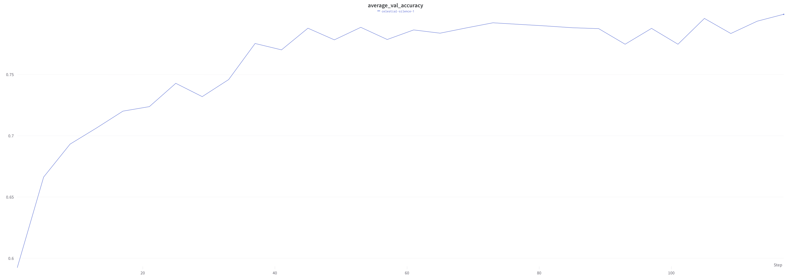
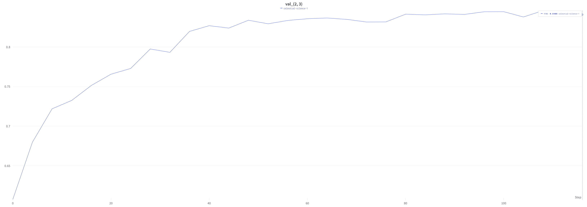
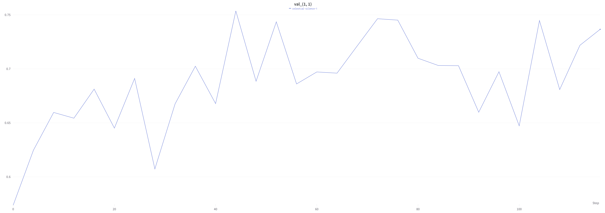
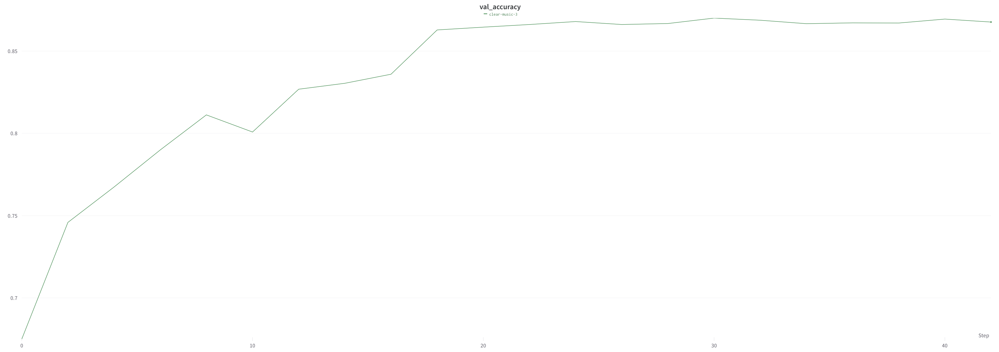
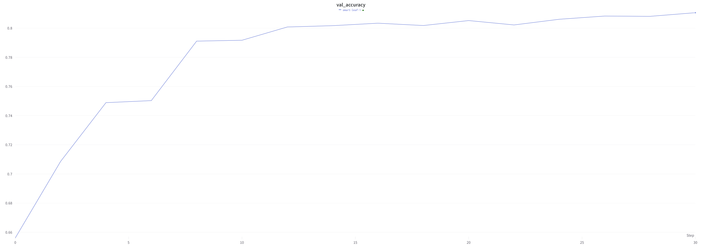

# Краткие результаты

Данный репозиторий содержит код модели Supernet с заданной в задании архитектурой.
Стуктура кода была выбрана мною для возможности гибкого (с небольшими изменениями) увеличения сложности модели при расширении пространства поиска. 

Мои последующие шаги, не реализованные в связи с ограниченностью времени:

0. Рефакторинг, пересмотр некоторых решений, улучшение пайплайна, улучшение покрытия тестами
1. Изменение распределения выбора блоков при обучении (приведение к, например, только 1: 1/3; 2 (и 1): 2/3; (при условии 2) 3 (и 1,2) 1/2)
2. Небольшие корректировки фиксированных блоков (добавить еще линейные слои с дроп-аутом, например) 
3. 
   1. Увеличение глубины модели
   2. добавление skip-connections и вместе с ним дроп-аут на обучении
   3. параллелизация разных конфигураций архитектур при обучении разных батчей 
   4. По низкой дисперсии результатов one-shot модели можно сделать вывод о недостаточности пространства поиска -> расширение пространства поиска в каждой ячейке - новые ядра конволюции, max/avg pools

3. проверить корректность новой реализации повторив принципиально важный экспериментальный результат оригинальной статьи -  зависимость между точностью супернет модели и расстоянием KL между предсказаниями
4. пространство поиска все же довольно ограничено (по сравнению с, например, генерацией архитектур обучаемым агентом). 
Также известно, что искомые точные архитектуры занимают крайне малую часть протсранства поиска. В связи с этим я пробовал бы уменьшать количество фиксированных блоков и пробовал различные варианты вплоть до постановки переменной ячейки первым слоем. Безусловно возникают вопросы стабильности особенно в начале обучения... Из идей: поменять вероятностное распределение дроп-аута в общем и для начальных слоев, возможно, на начальных слоях выделить большую вероятность более "зарекомендовавшим" себя блокам. 
5. Идея для улучшения стабильности - составить первые переменные блоки из различных (по ядрам и тд) фильтров предобученных сетей, исходя из предположения, что данные первые слои отвечают за базовые (низкоуровневые) детали изображения
6. Просто интересно (+ экспериментальный результат статьи с отфильтровыванием неоптимальных) было бы вставить переменную ячейку в предобученную архитектуру и посмотреть приближается ли оригинальная архитектура, при несовпадении какие различия по выходам и предсказаниям и тд
7. Возможно посмотреть в сторону комбинации подходов, условно более экономная генерация RL агентом

## Экспериментальный результат 

Ввиду ограниченности вычислительных ресурсов, ограничимся рассмотрением предельных случаев. 

Модель &emsp;&emsp;&emsp;&emsp;&emsp;&emsp;&emsp;&emsp;&emsp;&emsp;&emsp;&emsp;&emsp;&emsp;&emsp;&emsp;&emsp;&emsp;&emsp;&emsp;ACC(supernet) &emsp;&emsp;&emsp;&emsp; ACC(standalone)

Best_supernet_[2,3] &emsp;&emsp;&emsp;&emsp;&emsp;&emsp;&emsp;&emsp;&emsp;&emsp;&emsp;&emsp;&emsp;&emsp;&emsp;&emsp; 0.846 &emsp;&emsp;&emsp;&emsp;&emsp;&emsp;&emsp;&emsp;&emsp;&emsp; 0.870

Worst_supernet_[1,1] &emsp;&emsp;&emsp;&emsp;&emsp;&emsp;&emsp;&emsp;&emsp;&emsp;&emsp;&emsp;&emsp;&emsp;&emsp;&emsp; 0.754 &emsp;&emsp;&emsp;&emsp;&emsp;&emsp;&emsp;&emsp;&emsp; 0.808

Average supernet accuracy on validation:

Best sampled architecture accuracy:

Worst sampled architecture accuracy:

Best sampled architecture standalone accuracy: 

Worst sampled architecture standalone accuracy:

